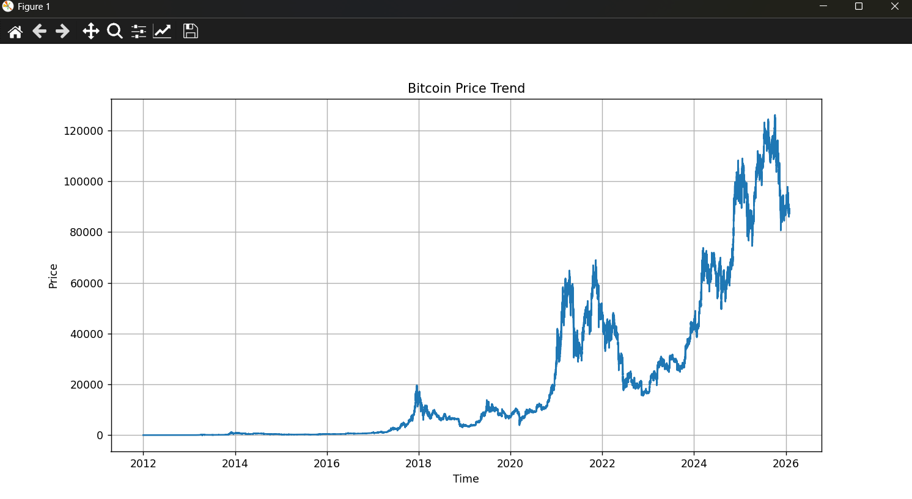
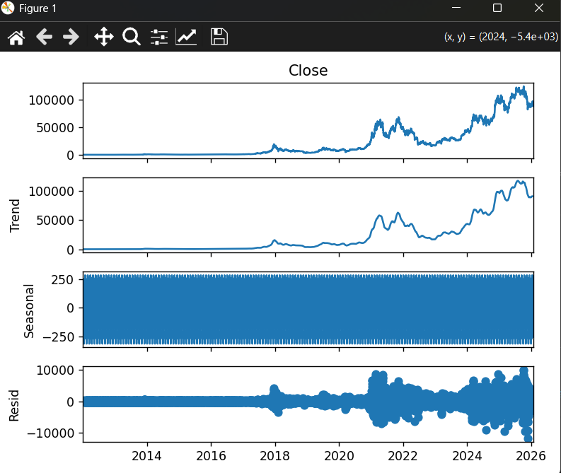
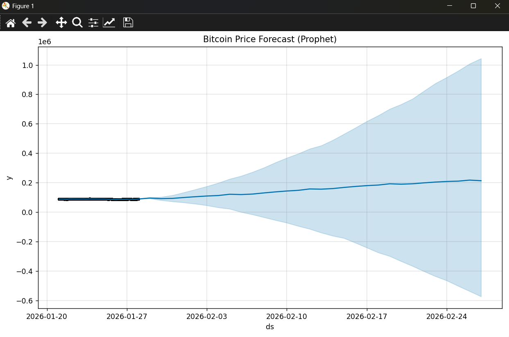
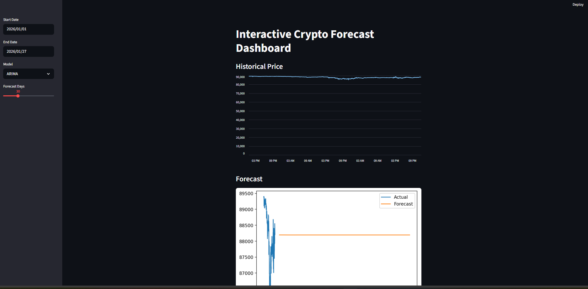

# Crypto Time Series Forecasting 📈

This project focuses on analyzing and forecasting cryptocurrency prices using time series techniques.  
It covers data preprocessing, exploratory data analysis, seasonality detection, forecasting models, and an interactive dashboard.

## Project Overview
The main objective of this project is to understand historical crypto price behavior and predict future prices using:
- ARIMA
- Prophet
- Seasonal Decomposition
- Streamlit Dashboard

## Features
- Data cleaning and preprocessing
- Exploratory Data Analysis (EDA)
- Seasonal decomposition (Trend, Seasonality, Residual)
- ARIMA forecasting
- Prophet forecasting
- Interactive Streamlit web app

## Tech Stack
- Python
- Pandas, NumPy
- Matplotlib, Seaborn
- Statsmodels
- Prophet
- Streamlit
- Scikit-learn

## Seasonality Analysis
Seasonality was analyzed using **seasonal decomposition** to break the time series into:
- Trend
- Seasonality
- Residual (noise)

This helped in understanding repeating patterns before applying forecasting models.

## How to Run the Project

## 1. Clone the repository
```bash
git clone https://github.com/sushiladmane/crypto-time-series-forecast.git
```

## 2. Install dependencies
```bash
pip install -r requirements.txt
```
## 3. Run individual scripts
```bash
python eda.py
python seasonality.py
python arima.py
python prophet.py
```
## 4. Run Streamlit dashboard
```bash
streamlit run app.py
```

## Output
- Historical price plots
- Seasonal decomposition graphs
- Forecast plots from ARIMA and Prophet
- Interactive dashboard for visualization

## Learning Outcomes
- Understanding time series components
- Detecting seasonality patterns
- Applying statistical forecasting models
- Building end-to-end data science projects
- Creating interactive dashboards with Streamlit
  
## Screenshots

### EDA


### Seasonality


### Prophet Forecast


### Streamlit App


## Author
Sushil Admane
(Aspiring Data Analyst / Data Scientist)


